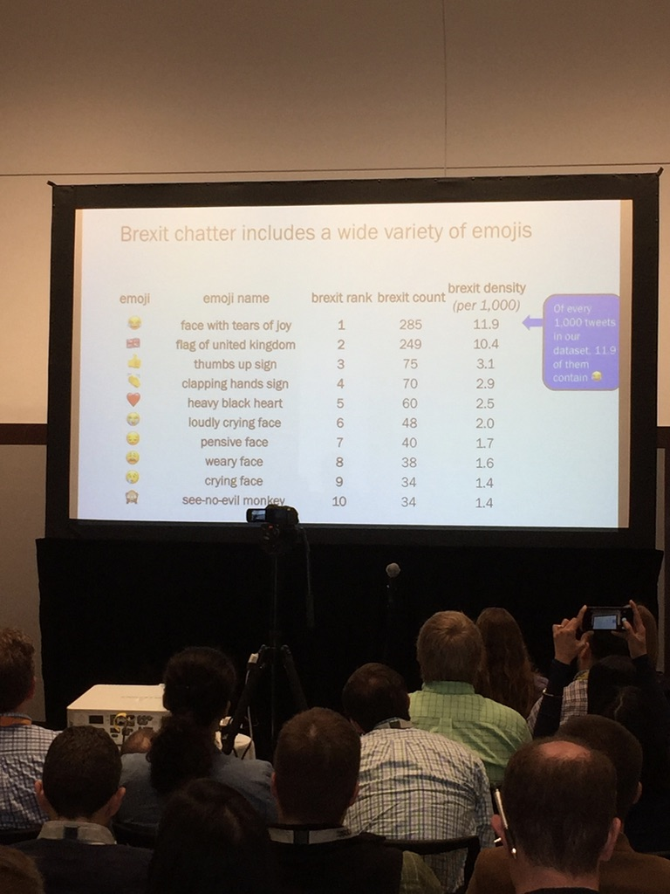
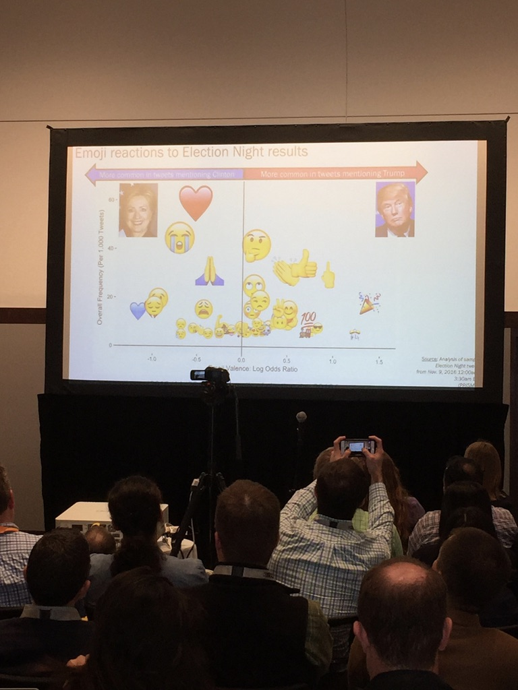
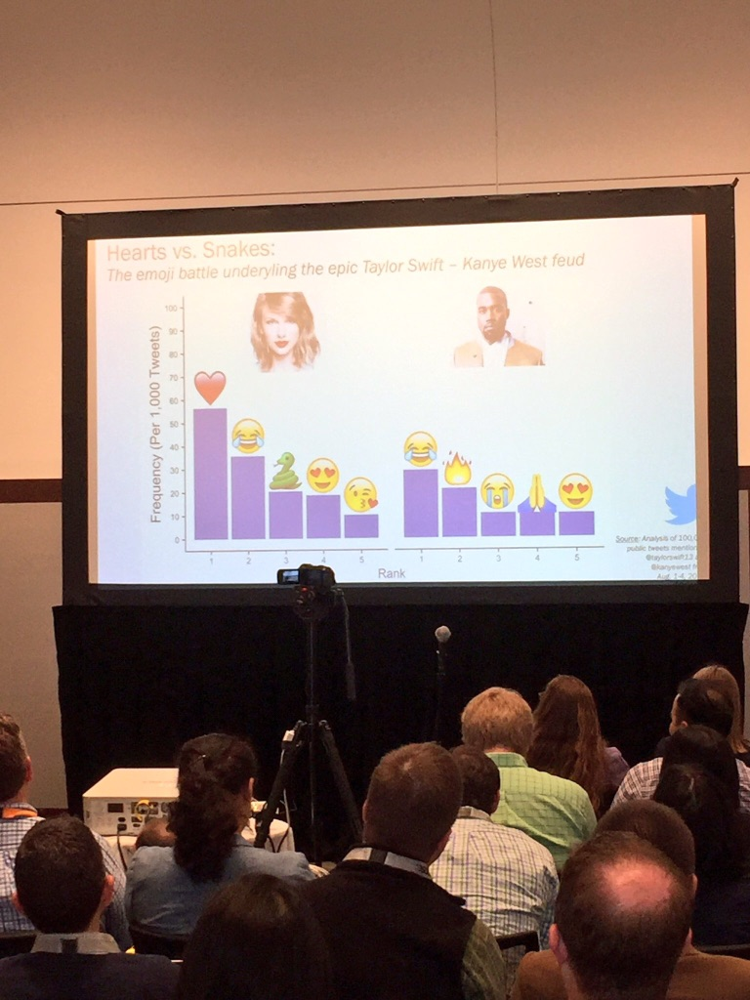

# odsc17-notes
Notes for talks and sessions at Open Data Science Conference 2017 | East  :sailboat:

The Open Data Science Conference 2017 | East      
Wednesday, May 3 - Friday, May 5 2017       
Hynes Convention Center, Boston, MA        

## Important Links

- Twitter hashtag: [#ODSC](https://twitter.com/search?q=%23ODSC&src=tyah)
- [Schedule](https://www.odsc.com/boston/schedule) 

----

## Thursday

### Sessions I want to attend: 

- Keynote Address (9:30 AM in Room 302,304,306)

### Challenges and practical solutions in successful developing and delivery of data science applications (11:00 AM in Room 309) | [R-Brain](https://r-brain.io/en/)

- **Five steps in building a model for data analytics from**:
prep, model development, collaboration, validation, deployment

1. Model development:

    1. **Challenges**: different tools and languages; integration; individual preferences; Security vs. Flexibility; resource allocation
    2. **Solutions**: IDE's custom for DS; language kernels; server-based IDE's or Virtual machine (containers like Docker) but they are not built for sharing. Cloud platforms with combination with _containers_ can be a flexible option

2. Collaboration & validation:

    1. **Challenges**: Reproducibility; Communication between modelers and SME/business people (practicality vs business constraints); Hardware & Software
    2. **Solutions**: Code development best practices (Git/GutHub) - problems arise with package versions and environment dependencies. Models as _containers_.

3. Delivery / Deployment:

    1. **Challenges**: User interface and interpretation; Scaling and resources; security and access
    2. **Solutions**: Web app frameworks (shiny, bokeh); _Container technology_. cloud platform s can enable easy refinement of user access.

- **What is container technology (Docker)?**: wrap a piece of Software in a complete filesystem. Have shared HW but different containers. Don't need local host anymore!

- **Benefits of using cloud**: meet increasing storage demands, faster time-to-market, cost savings, improved disaster recovery plans.

- **Migrating to cloud using containers**: development and environment tools :arrow_forward: building and maintaining images :arrow_forward: installation of system libraries in the containers :arrow_forward: container orchestration (devOps role) :arrow_forward: deployment.

- _Precision agriculture: Predicting outcomes for farmers using machine learning to help feed the world (11:45 AM in Room 301)_

### An introduction to emoji data science (12:30 PM in Room 310) | [Prismoji](https://prismoji.com/)

- Introduction to emoji data science tutorial: https://prismoji.com/2017/02/06/emoji-data-science-in-r-tutorial/
- Topics: 
  - Storytelling with emojis
  - Sentiment analysis on social media 
  - Time series analysis based on emojis
  - Data journalism with emojis
  
  

 
Emoji Data Science Pictures

---

**Lunch Break & Speaker interview with [George](george@odsc.com)** :heavy_check_mark:

---

### Analyzing Evictions During the Housing Crisis (1:30 PM in Room 313)

- Quantitative approaches in Kansas City
- **Data**: county court files, American community survey 5-year census data
- **Tools**: Dataiku Data science studio, Geocode.io, censusreporter.org
- **Data Cleaning**: Fuzzy matching ~ distance between strings to get spelling differences together
- **Data transformation**: transform latitude and longitude into corresponding census blocks with the census track API
- **Data viz**: D3.js but mostly leaflet for ease in making choropleth maps
- **Modeling**: Correlation analysis (`pandas` .cor function) for selecting a few variables; 
- **Machine Learning**: Build a model for interpretable descriptive statistics (i.e. Logistic Regression) rather than predition; Random split for train/test to avoid geography bias in census blocks; Leverge RF & GBM for feature importance (similar to correlation matrix from previous step):
   - GBM sklearn implementation: analyze purity gain at each split but doesnt explain which way it impacts the prediction
   - Logistic regression gives insight to _direction_ of feature impact

### Selling Flowers with Analytics (2:15 PM in Room 310)

- Modern Approaches to Finance (3:00 PM in Room 311)
- Anomaly Detection in Wireless Networks using Mobile Phone Data (4:15 PM in Room 301)
- Balancing Causal and Predictive Modeling at Wayfair (5:00 PM in Room 301)

## Friday

- Geospatial Voronoi Analysis (9:00 AM in Room 310)
- Behind the scenes of training, managing and deploying machine learning models (9:00 AM in Room 313)
- Telling a Quantitative Story (9:45 AM in Room Ballroom A)
- Recommendation systems at Zillow Group (11:00 AM in Room 310)
- Making Decisions Under Uncertainty Using Bayesian Inference and Stan (11:45 AM in Room 309)

### Open Government Data and Beer Analytics (12:30 PM in Room Ballroom A) | [Slides](https://jasdumas.github.io/talks/odsc-boston/odsc-open-gov-beer.html#(1))

- Intro to D3 (1:30 PM in Room 302)
- Interpretability and the Future of Machine Learning (2:15 PM in Room Ballroom A)
- Interactive Plotting with Matplotlib (3:00 PM in Room 311)
- Rapid Prototyping Data Products using Shiny (4:15 PM in Room 310)
- Applying Data Science Tools to Understand Web Traffic Data (5:00 PM in Room 310)
